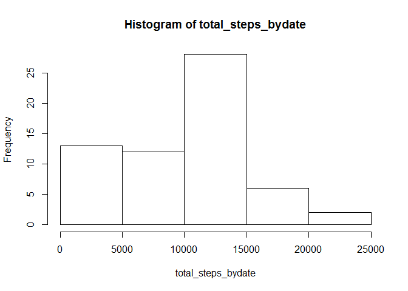
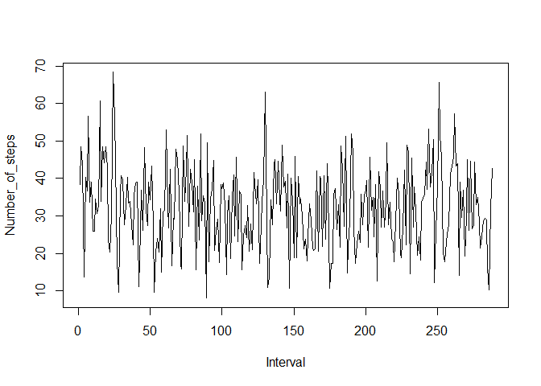
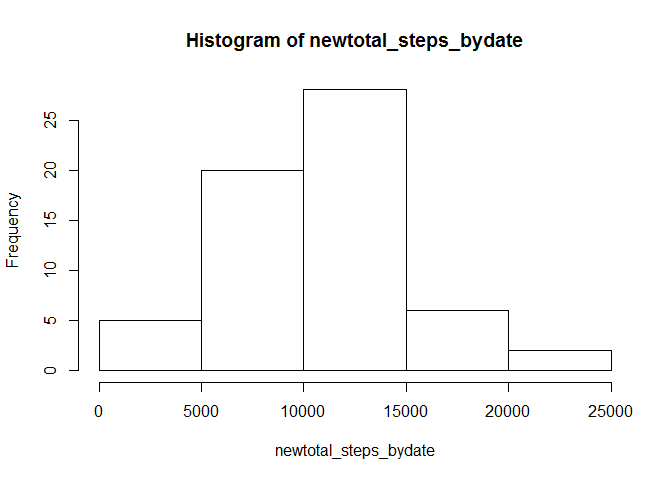
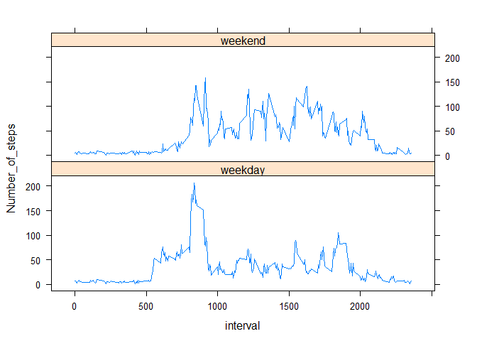

# Analysis personal activity data
Xiaonan Li  
Tuesday, April 07, 2015  

This is an R Markdown document. Markdown is a simple formatting syntax for authoring HTML, PDF, and MS Word documents. For more details on using R Markdown see <http://rmarkdown.rstudio.com>.

When you click the **Knit** button a document will be generated that includes both content as well as the output of any embedded R code chunks within the document. You can embed an R code chunk like this:
##Loading and preprocessing the data##


```r
unzip("activity.zip",exdir=".")
activity <-read.csv("activity.csv")
```
##Claculate the mean of total number of steps taken per day##
###1. Calculate the total number of steps taken per day###


```r
step_sum <-with(activity,tapply(activity[,1],activity[,2],sum,na.rm=T))
```
###2.Make a histogram of the total number of steps taken each day###


```r
step_df <-data.frame(step_sum)
total_steps_bydate <-(step_df[,1])


hist(total_steps_bydate)
```

 

Figure 1.  Total number of steps taken per day. 

###3.Calculate and report the mean and median of the total number of steps taken per day###


```r
summary(total_steps_bydate)
```

```
##    Min. 1st Qu.  Median    Mean 3rd Qu.    Max. 
##       0    6778   10400    9354   12810   21190
```
The mean and the median of the total number of steps taken per day are 9354 and 10400 respectively.

##Analysis the daily activity pattern##
### 1.Calculate averaged step for every 5-minute interval across all days. ###
First, we rearrange the data file by interval ascending using dplyr package. Then we summary the data file with group of interval value


```r
library(dplyr)
```

```
## Warning: package 'dplyr' was built under R version 3.1.3
```

```
## 
## Attaching package: 'dplyr'
## 
## The following object is masked from 'package:stats':
## 
##     filter
## 
## The following objects are masked from 'package:base':
## 
##     intersect, setdiff, setequal, union
```


```r
act_byinterval <-arrange(activity,interval)
sum_byint <-with(act_byinterval,tapply(act_byinterval[,1],activity[,3],sum,na.rm=T))
total_steps_byint <-data.frame(sum_byint)
```
By now, we have total number of steps for each 5 minute interval. Then we need calculate the average steps across all days, whith is:

```r
a <-length(levels(activity$date))
a
```

```
## [1] 61
```
61 dayes. Thus the average steps across all days is:


```r
ave_steps_byint <-total_steps_byint/61
```
Make a time series plot (i.e. type = "l"). 

```r
ave_steps_byint1 <-as.ts(ave_steps_byint) 

plot.ts(ave_steps_byint1, xlab="Interval",ylab="Number_of_steps",type="l")
```

 

Figure 2.  The averaged step for every 5-minute interval across all days. The x-axis is the number of the 5-minute interval, and the y-axis is the average number of steps taken in each interval and averaged across all 61 days.

### 2.Which 5-minute interval contains the maximum number of steps? ###
 

```r
summary(ave_steps_byint)
```

```
##    sum_byint     
##  Min.   : 8.066  
##  1st Qu.:24.221  
##  Median :33.098  
##  Mean   :32.480  
##  3rd Qu.:40.213  
##  Max.   :68.311
```
On the average across all the days in the dataset,the maximum number of steps taken in 5-minute interval is about 68 (68.3).


```r
max <-ave_steps_byint[,1]>68.311
ste_max <-ave_steps_byint[max,]
ste_max
```

```
##      155 
## 68.31148
```
And the maximum step happened on the 1:55:00~2:00:00 this 5-minute interval.

##Imputint missing values##
### 1.Calculate and report the total number of missing values in the dataset.###

```r
n_na <-mean(is.na(activity[,1]))
number_na <-n_na*nrow(activity)
n_na
```

```
## [1] 0.1311475
```

```r
number_na
```

```
## [1] 2304
```
In the column 1 of this data table, there is about 13.11% of missing values (NAs). The total number of NA is 2304.

###2.Filling in all of the missing values in the dataset by the mean for that 5-minute interval.###

In this section,I will use average steps in each 5-minute interval to replace the NA's. First, I'll add an index to the dataframe


```r
rname <-rownames(ave_steps_byint)
sum_df<-data.frame(sum_byint,row.names=c(1:288))
ave_byint <-data.frame(cbind(sum_df/61,rname))
```
Second, I'll do a "for loop" to replace NA's by the average value for that 5-minute interval.

```r
n <-1:17568
m <-1:288
for (i in 1:length(n))
  {
    if (is.na(act_byinterval[i,1])==TRUE)
    {
      for(j in 1:length(m))
      {
        if (act_byinterval[i,3]==ave_byint[j,2])
       {act_byinterval[i,1] <-ave_byint[j,1]
        }
      }
    }
  }
```
Now, I have a dataset "act_byinterval"" that with all the NA's been replaced by corresponding average step numbers.

###3. Create a new dataset that is equal to the original dataset but with the missing data filled in.###


```r
activity_nNA <-arrange(act_byinterval,date,interval)

str(activity_nNA)
```

```
## 'data.frame':	17568 obs. of  3 variables:
##  $ steps   : num  38.4 48.6 43.7 13.7 40.3 ...
##  $ date    : Factor w/ 61 levels "2012-10-01","2012-10-02",..: 1 1 1 1 1 1 1 1 1 1 ...
##  $ interval: int  0 5 10 15 20 25 30 35 40 45 ...
```
The date frame "activity_nNA" is same as original one but all the NA's have been replaced.

###4.Make a histogram of the total number of steps taken each day###

```r
newstep_sum <-with(activity_nNA,tapply(activity_nNA[,1],activity_nNA[,2],sum))

newstep_df <-data.frame(newstep_sum)
newtotal_steps_bydate <-(newstep_df[,1])


hist(newtotal_steps_bydate)
```

 

Figure 3.  Total number of steps taken each day with all the NA's have been replaced. 

By calculated the mean and median of the total number of steps taken per day. 

```r
summary(newtotal_steps_bydate)
```

```
##    Min. 1st Qu.  Median    Mean 3rd Qu.    Max. 
##      41    9354   10400   10580   12810   21190
```
The results indicated that the values are differ from the estimates from the first part of the assignment. 

```r
summary(total_steps_bydate)
```

```
##    Min. 1st Qu.  Median    Mean 3rd Qu.    Max. 
##       0    6778   10400    9354   12810   21190
```
The min., 1st Qu. values and even mean have been impacted by imputing missing data.  The median,3rd Qu and max. keeped same. 

##Calculate activity patterns between weekdays and weekends.##
###1. Create a new factor variable in the dataset with two levels - "weekday" and "weekend" indicating whether a given date is a weekday or weekend day.###

First, add a column to the dataset, which with the filled-in missing values, that indicate the week days

```r
wdays <-weekdays(as.Date(activity_nNA$date))
w_activity <-data.frame(mutate(activity_nNA,wdays))
```

Second, extract the weekend and weekday dataset. 

```r
weekend_activity <-filter(w_activity,wdays=="Saturday"|wdays=="Sunday")

wday_activity <-filter(w_activity,wdays=="Monday"|wdays=="Tuesday"|wdays=="Wednesday"|wdays=="Thursday"|wdays=="Friday")
```
Calculate the total number of steps in each 5-minute interval for weekend and weekday respectively.

```r
sum_byint_weekend <-with(weekend_activity,tapply(weekend_activity[,1],weekend_activity[,3],sum, na.rm=TRUE))

sum_byint_wday <-with(wday_activity,tapply(wday_activity[,1],wday_activity[,3],sum, na.rm=TRUE))
```
###2.Make a panel plot containing a time series plot (i.e. type = "l") of the 5-minute interval (x-axis) and the average number of steps taken, averaged across all weekday days or weekend days (y-axis).###

Form a new dataset with both weekend and weekday average steps data each 5-minute interval.

```r
d1 <-factor(weekend_activity[,2])
d2 <-factor(factor(wday_activity[,2]))
m1 <-length(levels(d1))
m2 <-length(levels(d2))


wday <-factor(c(rep("weekend",288), rep("weekday",288)))

ave_byint_weekend <-data.frame(sum_byint_weekend/m1)
colnames(ave_byint_weekend) <-"Number_of_steps"
ave_byint_wday <-data.frame(sum_byint_wday/m2)
colnames(ave_byint_wday) <-"Number_of_steps"
wst_ave_byint <-data.frame(rbind(ave_byint_weekend,ave_byint_wday))

interval<-as.numeric(c(row.names(ave_byint_wday), row.names(ave_byint_wday)))
wst_ave_byint1 <-data.frame(cbind(wst_ave_byint, interval,wday))
```
Make a panel plot 


```r
library(lattice)
xyplot(Number_of_steps~interval|wday,wst_ave_byint1, type="l", layout=c(1,2))
```

 

Figure 4. The averaged step for every 5-minute interval averaged across all weekday days and weekend days (y-axis). The x-axis is the time in minute.


